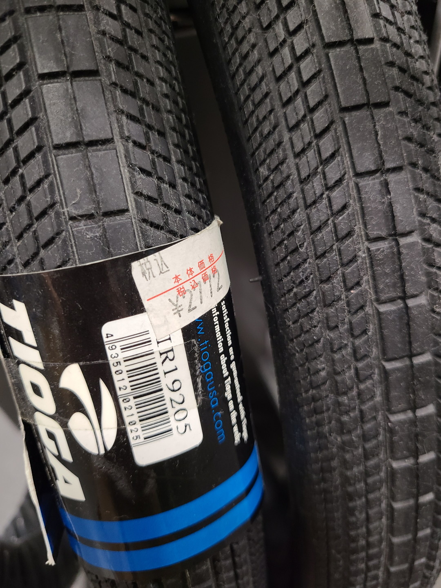
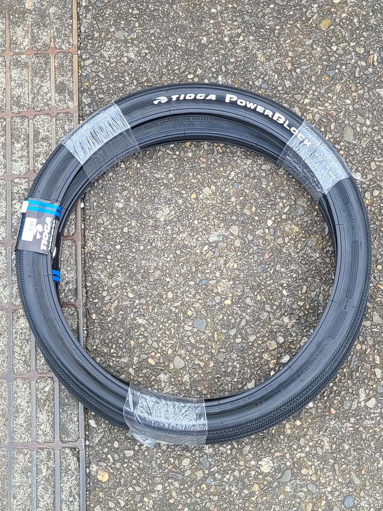
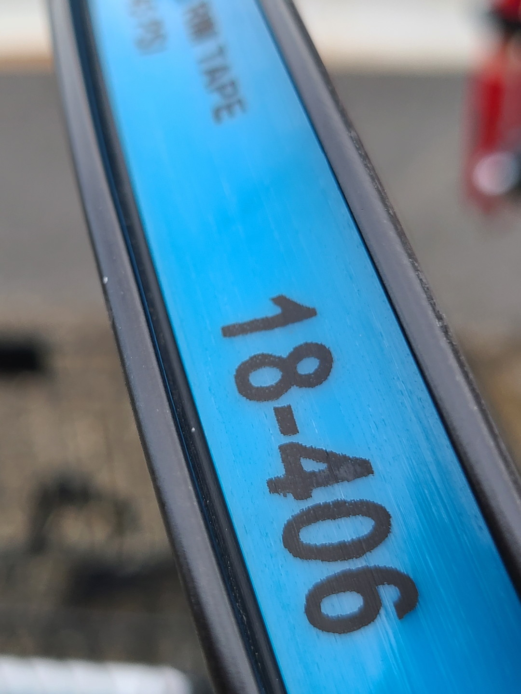
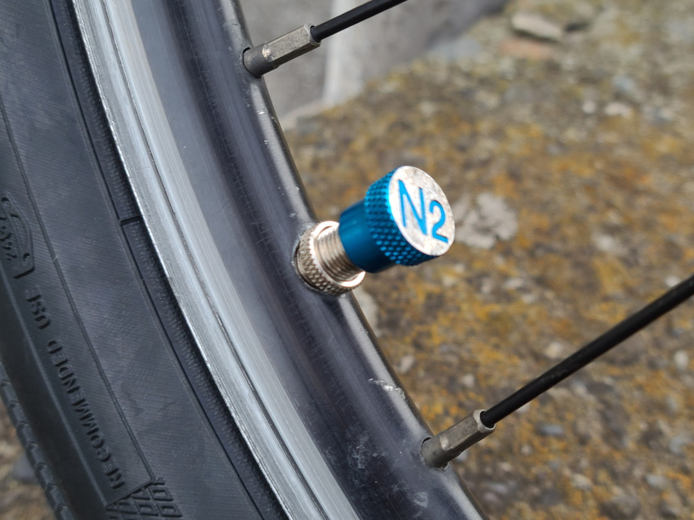
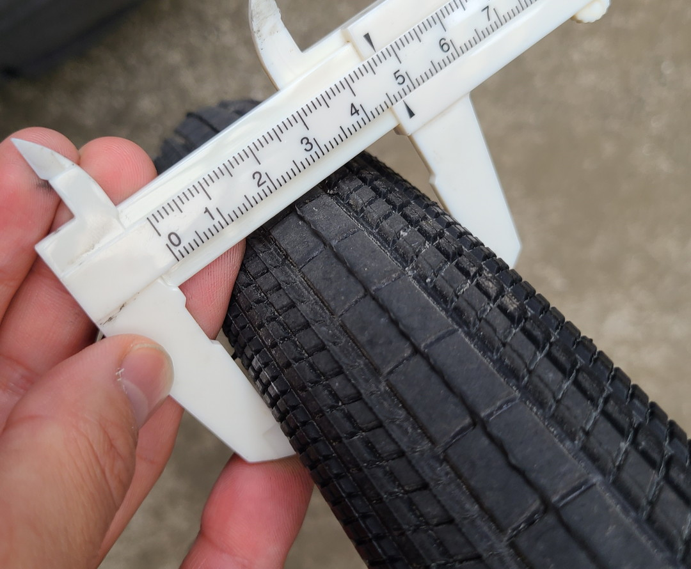

# ミンミンゼミの最終定理

## ~DAHON SPEED P8編~

---

**タイヤサイズを増強した。**  
投稿日:2022-10-19

---

### 20×1.95の世界へ

ある日友人から某店で[TIOGA Power Block](https://tiogajpn.com/products/tire/tir19203.html)の20x1.95が1本2000円、前後で4000円で売ってると言われた。自分が使っていた[ファストR-X](https://tiogajpn.com/products/tire/tir28800.html)の20x1.6は摩耗していたのでこれを機に変えてしまうと思った。

PowerBlock / ファストR-X

---

### 2000円じゃない

さっそくその某店の在庫を見に行ったらたしかに置いてあった。しかし価格表示を見ると

んー、高くないか。ということで発見者の友人に連絡を取ると

金銭感覚ががばっていただけだった……。まあそれでもECサイトで買うよりは安いので購入した。ついでにリムテープとチューブも刷新した。
どうでもいいけど途中で食べたクレープが美味しかった。

---

### 履き替え、そして米式化

タイヤ交換自体はそんなに珍しいものでもないので色々割愛させて頂く。ただ[この間話してた米式化](6.html)を行った。

仏式と米式、並べてみると太さが段違いだ。

リムテープはオーソドックスにシュワルベの18mmを使用。ただ思ったより余ったので20でも良かったかもしれない。別に穴が塞がればなんでもいいんだけど。
ちなみに私の人生はノーメンテなので白昼堂々と替えてたら小学生に「なんで自転車壊してるの？」って聞かれたぞ。「一度壊さないと直せないんだよ」と適当なことを言ったが、多分間違ってない。

ついでにバイクのバルブキャップを移設した。知る人ぞ知るN2マーク。

あまり空気を入れてない状態じゃなくても明らかに太い。

空気を最大までいれたら47cmだった。リムをもっと太いものに変えれば49cmまで行くだろう。
正直この界隈みんなBigApple履いてるとは言え1.95でも適正値ぎりぎりかもしくはオーバーなのできちんと履けてよかった。

リムテープ

---

### 乗り心地

軽い、びっくりするくらい軽くなった。今まで履いていたタイヤよりも200gくらい重くなったはずなのに速度がのる。

[【検証406×451問題】走れる20インチは451ホイール…なんて誰が決めた?! 406ホイール+ドデカいタイヤでガシガシ走るパワフルな折りたたみ！【DAHON】 | 神戸で自転車をお探しならY's Road 神戸店](https://ysroad.co.jp/kobe/2018/04/01/38949)

この記事でも言われているように20インチ406に1.95を履かせると実質451くらいの直径になる。最初は半信半疑だったが実際に試すと感覚が大きくかわってびっくりした。たしかにこれからは1.95より下は選択肢から消えそうだ。そして451を選びたがる人の気持ちも少しわかった気がする。
ということで今回は米式化とタイヤ交換をした。次回は色々考えた挙げ句やっと決めたハンドルバーについて書こうと思う。ではまた～。

---

[一覧へ](./Link.md)  
[トップへ](/)

---

※[Google Analytics](https://wahoij.github.io/GAPolicy.html)で解析を行ってます。  
サイト管理者：わくせい  
最終更新日:<time id="modify"></time>
