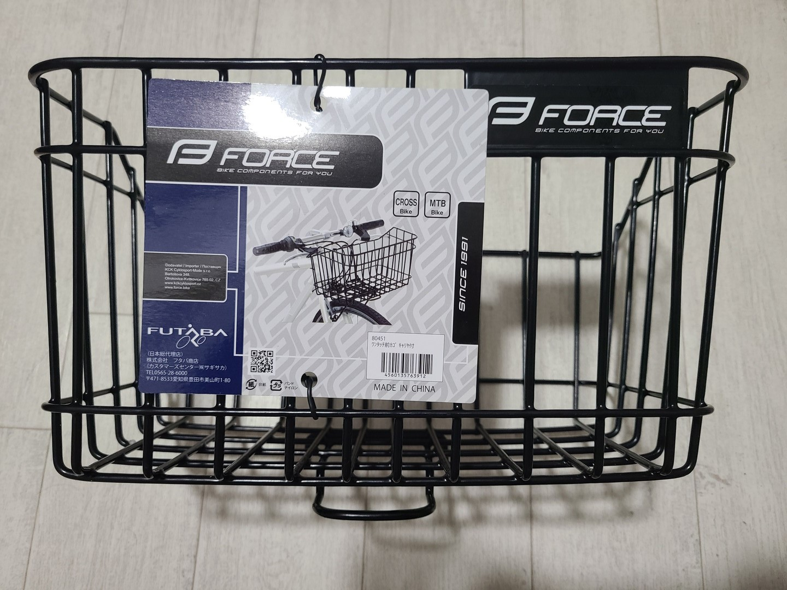
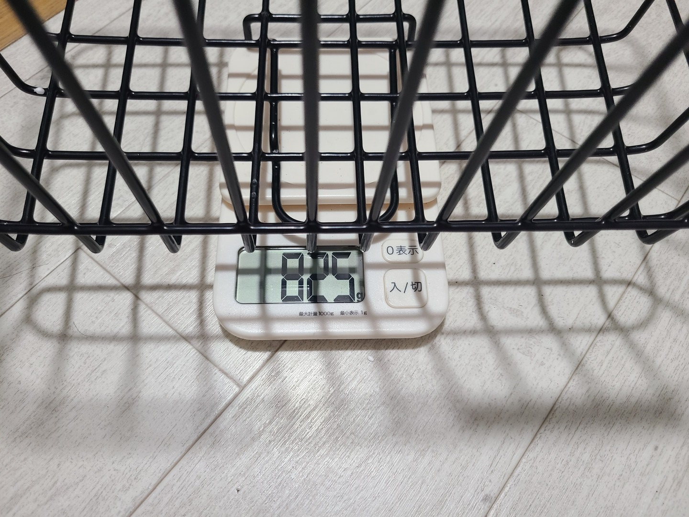
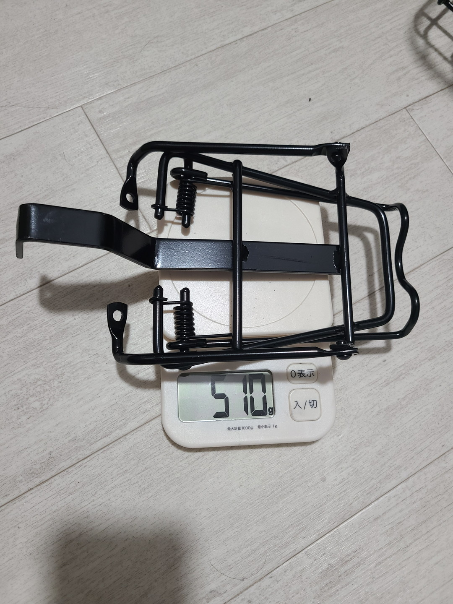
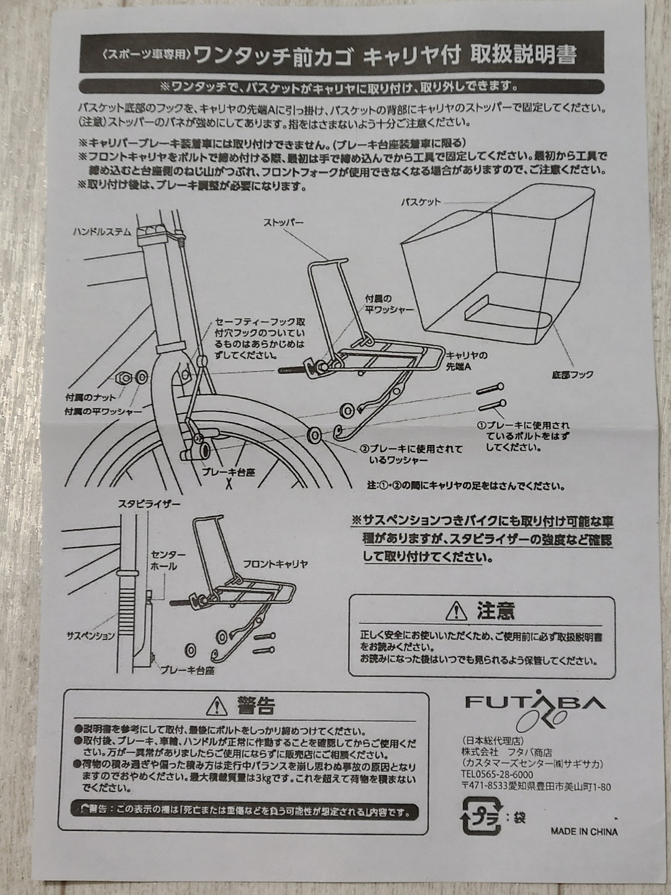
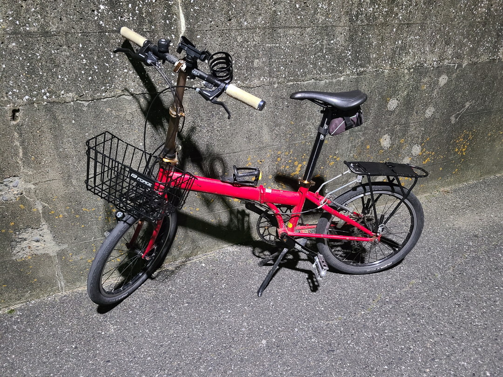
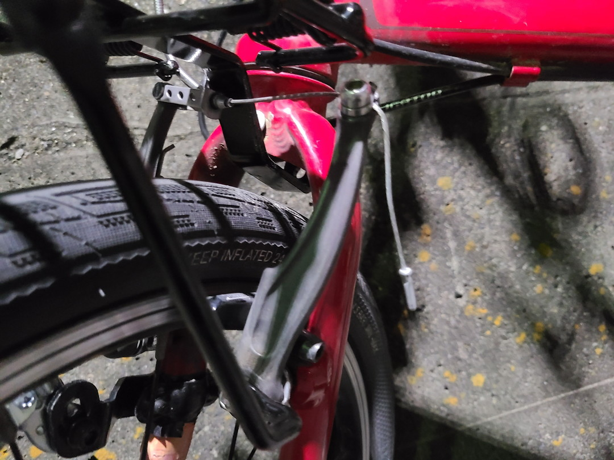
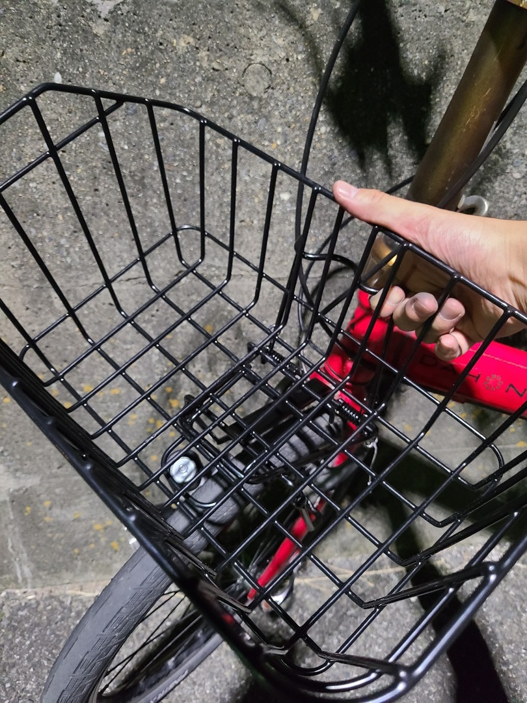
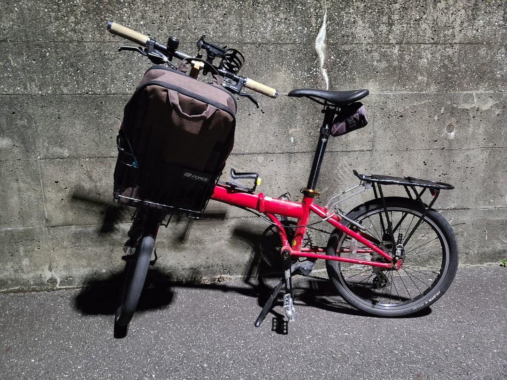
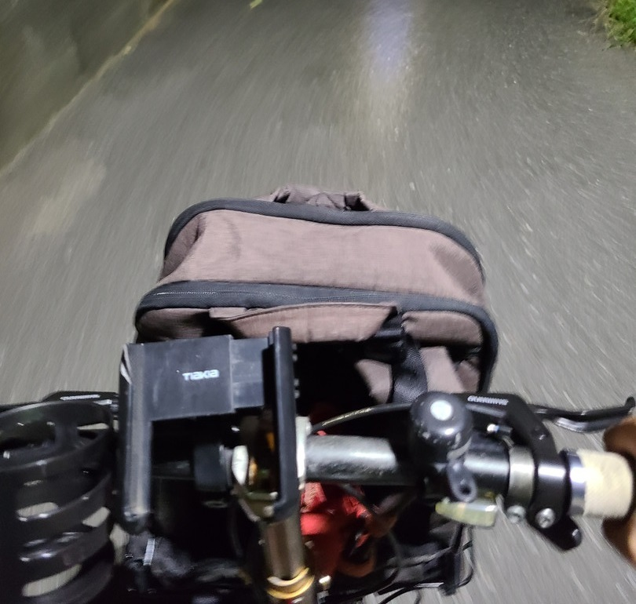

# ミンミンゼミの最終定理

## ~DAHON SPEED P8編~

---

**前カゴをつけよう**  
投稿日:2022-10-10

---

### All in Oneという考え方

[ライトの記事](4.html)でも話したようにミニベロ含めスポーツバイクにはママチャリには当然あるものが消失している。前カゴもやはりそのうちの一つだろう。特にミニベロ、もっというと折りたたみと前カゴなんて相性最悪なので中々つけられない。しかし、それができればママチャリ兼輪行スポーツバイクという全部載せになれるのではないか。というかしたい。マキシマリストなので。せっかく付けるならハンドルに付けるタイプじゃなくてカゴっぽいカゴにしたい。そんな欲張りなことを考えて過ごしていた。

---

### 突然現れる選択肢

メルカリで色々漁っていたある日、偶然Dahon K3にワンタッチ着脱可能な前カゴをついてる商品をみかけた。「これだ！」と思って更に調べたところ、EZのDAHON用バスケットらしい。

"DAHON ダホン EZ バスケット FRONT BASKET"

なるほど、これなら輪行の際はカゴが外せるので邪魔にならない。だが、6000円少々と値が張る。[véloline](https://www.gic-bike.com/product/veloline/carrier-basket_d/)も同じものを出していてこれはあさひの公式ECからなら若干やすかった。

[深型フロントキャリア&脱着式バスケット フロントバスケット 前用](https://ec.cb-asahi.co.jp/catalog/products/2F82BB71AB94489F97A097BB098B17D5)

もう一声…、そんな事を考えてたら見つけてしまった。

Forceが出している2500円のワンタッチキャリア！全くレビューもないので不安だが、安い。どうやら日本ではForceの製品はフタバ商店が取り扱っているらしい。
[ワンタッチ前カゴ＆ キャリア | フタバ商店](https://e-ftb.co.jp/item/3983/)
あとでホームセンターやイオンバイクにいくとFORCE社製の製品は割と置いてあるのに気づいたが買う前は割と疑っていた。そもそもVブレーキのスポークバイクに使えると書いてあるだけで何インチ用なのかもわからない。ちなみにモノタロウでの評価は低かった。
[ワンタッチフロントバスケット キャリヤ付 FORCE ATB・MTB・クロスバイク用 【通販モノタロウ】 80451](https://www.monotaro.com/g/05253007/)
上手く取り付けできないだの書いてあった。あと本国のサイトではカタログ落ちしてるようだったのでますます怪しい。
色々ググったがEscape R3につけてる画像があったくらいで後はよくわからなかった。
[クロスバイクがもっと快適になる！おススメアイテム5選｜FORCE（フォース） | Bicycle Club](https://funq.jp/bicycle-club/article/710320/)

**「……まあええか」（ポチ）**

---

### 届いた

どうにかなるだろうの精神で購入した。ちなみに全く関係ないのにAmazonのセール時に購入したせいで到着まで大混乱が生じた。

カゴにキャリアに説明書相変わらずシンプル。

カゴのラベルにはクロスバイクとMTBと記載されている。ここまで情報量なし。

カゴの重量は825g。流石に鉄の塊なので重い。

そしてキャリア部分の重量。510gと中々だった。

ちなみに今までつけてたAKI WORLDのキャリアは300g強なので1kgも重量が増えることになる。こいつは（フロント）ヘビーだ。

AKI WORLD

ちなみに説明書。図式がカンチブレーキだがいつの製品なんだ……。

---

### 案の定取り付けできない

正直モノタロウのレビューでわかりきってた話だが説明書通りにはつけられなかった。真ん中のステーとフォークのダボ穴を合わせると脇のステーがVブレーキのボルトに届かない。真ん中の長さ調整機構も存在しないので……。

**まあまあ、スタンダード……。**

無理やりつけた。

こんな風にブレーキワイヤーに干渉しないように凹型になってるのを利用して後ろからはめ込んだ。ただ隙間が開いてるのと多少Vブレーキと干渉するなど問題点は山積みなので暫定的処置。ステーを加工すれば安定するだろうけれど汎用性は薄い。たしかに車種によっては無理ゲーだろう。ちなみに後日当てにならない改造をしたので次回紹介する。

---

### カゴの使い勝手

着脱は本当に簡単だった。

後ろを上げて

カゴの凸部をキャリア下に差し込んで

後ろにはめ込めば完成。

とりあえず普段使ってるリュックサックも入った。

あーそうそうこれこれ。当然一般的なカゴよりは浅いがあるとないとでは大違いである。やっぱり便利なものは便利。ちなみにカゴを付けると前に伸びてるワイヤー類に干渉する可能性もあるのでやはりママチャリより扱いはシビアになる。これも次回やった改造で解決したけれど。
とりあえず今回はForceのワンタッチバスケットをどこまでポン付けできるかを調べたかったのでここまで。ではまた～。

---

[一覧へ](./Link.md)  
[トップへ](/)

---

※[Google Analytics](https://wahoij.github.io/GAPolicy.html)で解析を行ってます。  
サイト管理者：わくせい  
最終更新日:<time id="modify"></time>
